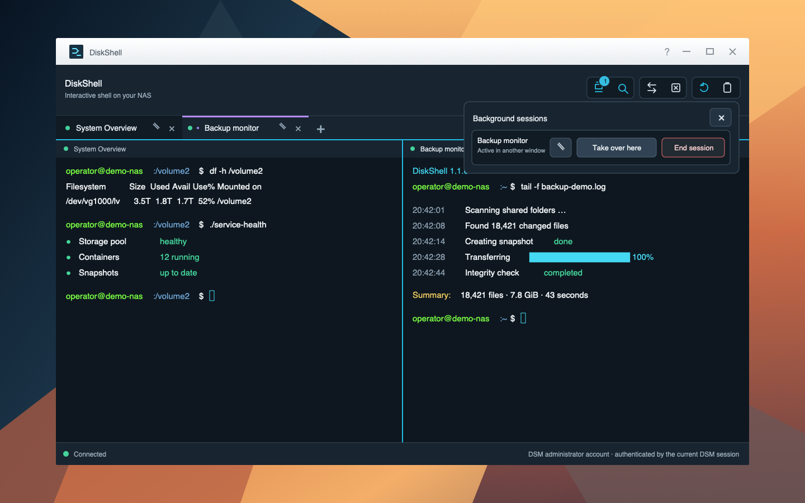

# DiskShell

A secure, native terminal for the Synology DSM desktop. DiskShell gives DSM
administrators a modern multi-tab shell with persistent sessions, split views,
search, uploads, and explicit clipboard controls—without exposing a separate
terminal port on the network.



## Features

- **Multiple shell tabs** — work in up to four independent terminals in one DSM
  window and rename them for quick orientation.
- **Background sessions** — keep a shell and its processes running after its tab
  or the DiskShell window is closed, then reopen it later.
- **Split view** — place two existing tabs side by side or one above the other,
  with clear pane ownership and independent terminal sizing.
- **Terminal search** — search each tab's scrollback with `⌘F` or `Ctrl+F` and
  navigate between matches.
- **Drag-and-drop uploads** — securely upload files into a private directory for
  the authenticated DSM account and insert their quoted paths into the shell.
- **Deliberate clipboard access** — Copy & Paste remains disabled until it is
  explicitly enabled for the current DiskShell window.
- **DSM-native authentication** — uses the current DSM session, allows DSM
  administrators only, and starts the shell under the authenticated account.
- **Responsive toolbar** — accessible icon controls, state-aware tooltips, and a
  compact layout that adapts to the DSM window.

## Installation

DiskShell currently targets **DSM 7.2 on x86_64 Synology systems**.

1. Download the latest `.spk` and its checksum from
   [GitHub Releases](https://github.com/dei79/disk-shell/releases/latest).
2. Verify the downloaded package against the `.sha256` file.
3. In DSM, open **Package Center → Manual Install** and select the SPK.
4. Launch **DiskShell** from the DSM main menu while signed in as an
   administrator.

DiskShell's service listens only on `127.0.0.1:16082`. DSM's nginx proxy exposes
the application under `/diskshell/`; no additional network port is published.

## Build from source

### Requirements

- Node.js 22 or newer
- npm
- Go 1.26 or newer
- GNU `tar`

Install dependencies, validate the project, and build an SPK:

```sh
npm ci
npm run check
npm test
npm run build
```

The package is written to:

```text
build/DiskShell-<version>-<revision>.spk
```

When multiple Go toolchains are installed, select one explicitly:

```sh
DISKSHELL_GO_BINARY=/path/to/go npm run build
```

Use a unique package revision for every package installed on a live DSM system.
This prevents DSM from reusing cached JavaScript or CSS assets:

```sh
DISKSHELL_PACKAGE_REVISION=42 npm run build
```

## Architecture and security

The browser UI is written in TypeScript and SCSS and uses xterm.js. A compact Go
service validates the active DSM session, verifies membership in the DSM
`administrators` group, and launches `/bin/sh` under that account through a
pseudo-terminal.

Important boundaries include:

- same-origin checks for terminal, session, and upload requests;
- bounded WebSocket messages, terminal output buffers, uploads, and concurrent
  shell sessions;
- per-account ownership for sessions and uploaded files;
- no DSM tokens in nginx access logs;
- a loopback-only backend behind DSM's existing web proxy.

Background sessions live inside the DiskShell service. They survive browser and
DiskShell window closures, but not a package restart, DSM reboot, or service
failure.

## Project layout

| Path | Purpose |
| --- | --- |
| `src/ui/` | DSM desktop UI, terminal components, styles, and translations |
| `native/` | Go HTTP/WebSocket service, session manager, PTY, and uploads |
| `payload/` | Files installed into the SPK payload |
| `conf/` | DSM package permissions and resource declarations |
| `scripts/` | DSM package lifecycle and service scripts |
| `test/` | Package, security-boundary, and integration tests |
| `build.mjs` | Deterministic frontend, native binary, and SPK build |

## Live DSM verification

Use a disposable DSM test system and a unique package revision. After
installation:

1. Confirm `/diskshell/health` returns `{"status":"ok"}` through the DSM URL.
2. Open DiskShell as a DSM administrator and run:

   ```sh
   printf '__DISKSHELL_OK__\n'
   id -un
   stty size
   ```

3. Verify the marker, authenticated account, and a non-zero terminal size.
4. Resize the DSM window and verify `stty size` changes accordingly.
5. Confirm non-administrator accounts cannot open a shell.

## Contributing

Contributions are welcome. Keep changes focused and preserve the authentication
and privilege boundaries.

1. Fork the repository and create a feature branch.
2. Install dependencies with `npm ci`.
3. Make the change and add or update relevant tests.
4. Run `npm run check` and `npm test`.
5. Open a pull request describing the behavior, security impact, and DSM testing
   performed.

Please do not test package installation on a production NAS.

## Releases

The version in `package.json` must match the semantic Git tag. Pushing a tag such
as `v1.1.0` runs the release workflow, builds revision `1`, generates a SHA-256
checksum, and publishes both files as a GitHub Release.

## License

DiskShell is available under the [MIT License](LICENSE).
